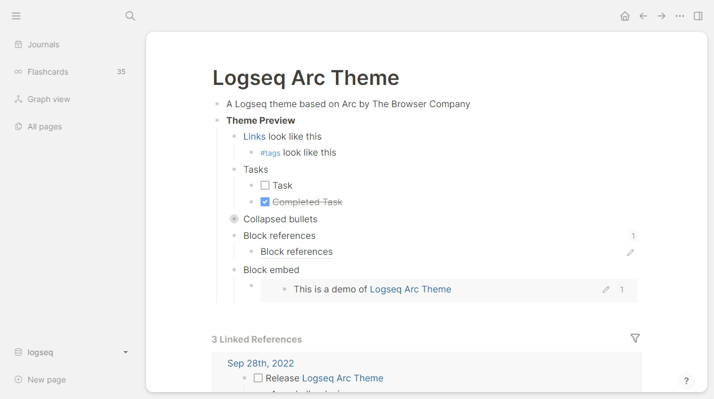

# logseq-arc-theme
A Logseq theme based on Arc by The Browser Company

### Screenshots 
(last updated v0.1)



### Installation
**Marketplace**

Find Arc Theme in the Logseq theme marketplace within the app.

**Manual installation**

Copy `custom.css` into `logseq/custom.css` or paste this line into `logseq/custom.css`:
```css
@import url('https://cdn.jsdelivr.net/gh/andyburris/logseq-arc-theme/custom.css');
```

### Building
1. Install [Sass](https://sass-lang.com/)
2. `sass --watch custom.scss custom.css`
3. Edit `custom.scss`