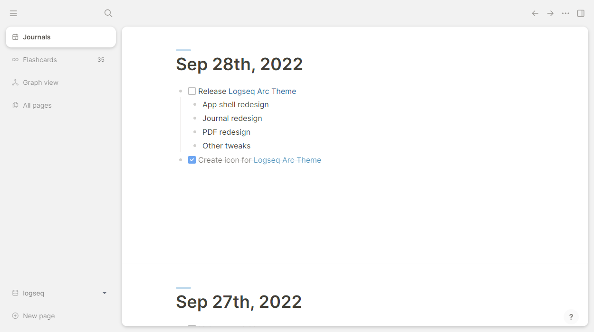

# logseq-arc-theme
A Logseq theme based on Arc by The Browser Company

### Screenshots 
(last updated v0.1)



### Installation
**Marketplace**

Find Arc Theme in the Logseq theme marketplace within the app.

**Manual installation**

Copy `custom.css` into `logseq/custom.css` or paste this line into `logseq/custom.css`:
```css
@import url('https://cdn.jsdelivr.net/gh/andyburris/logseq-arc-theme/custom.css');
```

### Customization Options
Currently, the following options (shown here with their default values) are available to customize the view, which you can put into your own `custom.css`
```scss
--display-pdf-arrows: none; // toggles whether the page up/down arrows are available in 
```

### Roadmap
Generally, I want to really polish each surface before moving on to the next one. Also, I will mainly be updating this as I go, so progress might be slow. In the meantime, there will probably be a lot of screens that are very default-looking (and maybe broken). For now though, here are the things I have and haven't done:

- [x] App shell
- [x] Journals
- [x] Other pages
- [x] PDF viewer
- [x] Left sidebar
- [x] Right sidebar
- [x] TODO styling (might revisit)
- [x] Table styling
- [x] Search styling (WIP)
- [ ] Reference/embed styling
- [ ] Popups for settings, etc. 
- [ ] Theme options for user `custom.css`
- [ ] Style + readd (as option) favorites + recent

If there's a surface that's not on here, or that you have ideas about how you'd like to see it fixed, feel free to open an issue, and I'll try to make it happen.

### Building
1. Install [Sass](https://sass-lang.com/)
2. `sass --watch custom.scss custom.css`
3. Edit `custom.scss`
